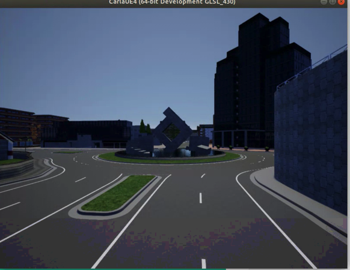

<p align="center">
  
</p>

[](https://pypi.python.org/pypi/carla-gym/)
[](https://pre-commit.com/)
[](https://github.com/psf/black)
[](https://github.com/johnMinelli/carla-gym/LICENSE)

Carla-gym is an interface to instantiate Reinforcement Learning (RL) environments on top of the CARLA Autonomous Driving simulator. It allows the training of agents (single or multi), the use of predefined or custom scenarios for reproducibility and benchmarking, and extensive control and customization over the virtual world. New environments and scenarios can be easily configured through XML documents (OPENScenario-like) or JSON configurations.

### Installation
##### Prerequisites
- **CARLA Autonomous Driving Simulator Server** installed locally. Otherwise, refer to the [Getting started](#getting-started) section below.
- `CARLA_SERVER` environment variable pointing to the CARLA executable.

You can install the package in the Python virtual environment of your choice with the following command:

`pip install carla-gym`


### Usage
The package allows you to interact with the CARLA simulator as a PettingZoo environment. You can instantiate an environment as follows:

```python
import carla_gym

env = carla_gym.env(**args)           # AEC API
env = carla_gym.parallel_env(**args)  # Parallel API
```

Examples of starter agents can be found in the examples folder. Any RL library that supports the standard multi-agent interface can be used to train the agents.

The environment expects mandatory configuration for initialization. This can be provided as an .xml file or as a json dictionary, which overrides the .xml configurations. Standard configurations are provided within the package and can be imported as follows:

```python
import importlib
from carla_gym.core.constants import DEFAULT_MULTIENV_CONFIG

# XML
with importlib.resources.open_text("carla_gym.scenarios", "stop_sign_1b2c1p_town03.xml") as file:
  env = carla_gym.env(xml_config_path=file.name)

# JSON
env = carla_gym.env(configs=DEFAULT_MULTIENV_CONFIG)
```
For additional information about the configuration, please refer to [Scenario configuration](#scenario-configuration) section, or for information about the initialization settings, refer to [Arguments](#arguments) section.

##### Functionalities:
- CARLA server self-hosting
- Multi-GPU support
- Configuration through XML OpenScenario-like or JSON
- Scenario specification supports both single and multiple agents
- Agents support automatic (autopilot) control, manual (keyboard) control, and default control as RL agents
- Supported agents: Vehicles (4w/2w), Pedestrian (manual control TODO), and Traffic lights
- Additional World actors with automatic control and set origin-destination
- Random traffic of vehicles and pedestrians
- Camera rendering for multiple agents and spectator view

### Guide
- [CARLA setup](#carla-setup)
- [Environment specifications](#Environment-specifications)
  - [Arguments](#arguments)
  - [Action space](#action-space)
  - [Observation space](#observation-space)
- [Scenario configuration](#scenario-configuration)
  - [Naming Convention](#naming-convention)
- [Contributing](#contributing)

### CARLA setup
CARLA server supports Ubuntu (18.04/20.04/22.04 or later)/Debian/W10/W11. You can refer to the [official CARLA docs](https://carla.readthedocs.io/en/latest/start_quickstart/) for the server installation process or follow the steps below:

(for Ubuntu 18.04/20.04/22.04/+)
1.  Install the system requirements:
    - Miniconda/Anaconda 3.x : `wget -P ~ https://repo.anaconda.com/miniconda/Miniconda3-latest-Linux-x86_64.sh; bash ~/Miniconda3-latest-Linux-x86_64.sh`
	- cmake : `sudo apt install cmake`
	- zlib : `sudo apt install zlib1g-dev`
	- [optional] ffmpeg : `sudo apt install ffmpeg`
2. Install CARLA (0.9.x)
    - `mkdir ~/software && cd ~/software`
    - Download the 0.9.13 release version from [official repository](https://github.com/carla-simulator/carla/releases)
    - Extract it into `~/software/CARLA_0.9.13`
3. Set the `CARLA_SERVER` environment variable:
    - `echo "export CARLA_SERVER=${HOME}/software/CARLA_0.9.13/CarlaUE4.sh" >> ~/.bashrc`

*NOTE: Currently Carla-gym supports CARLA 0.9.13*
*NOTE: Independently from Carla-gym, installing the required `carla` dependency (PyPI package containing CARLA client API) ensures it matches the version number of your CARLA server.*

### Environment specifications
```python
carla_gym.env(
  configs: dict = None,
  xml_config_path: str = None,
  max_steps: int = 500,
  render_mode: str = None,
  maps_path: str = "/Game/Carla/Maps/",
  sync_server: bool = True,
  fixed_delta_seconds: float = 0.05,
  render_width: int = 800,
  render_height: int = 600,
  actor_render_width: int = 84,
  actor_render_height: int = 84,
  discrete_action_space: bool = True,
  verbose: bool = False
)
```
- Note that for a flexible customization the JSON `configs` specifications override the ones parsed from the XML file specified in `xml_config_path`.
- For more information about sync/async mode of CARLA environment, refer to the [Carla official docs](https://carla.readthedocs.io/en/latest/adv_synchrony_timestep/#setting-synchronous-mode).

#### Arguments
`configs`: Scenarios configuration dictionary. Example provided in `carla_gym.core.constants.DEFAULT_MULTIENV_CONFIG`.
`xml_config_path`: Filepath to a compatible XML file with scenarios configs. Example provided in `carla_gym.scenarios.default_1c_town01.xml`.
`max_steps`: Maximum number of steps in the scenarios before the end of the episode.
`render_mode`: Mode of rendering. Only 'human' is available.
`maps_path`: Path where to find the external CARLA maps.
`sync_server`: Whether the CARLA server should be in synchronous or asynchronous mode.
`fixed_delta_seconds`: Fixes the time elapsed between two steps of the simulation to ensure reliable physics. Use 0.0 to work with a variable time-step.
`render_width`: Spectator view rendering width.
`render_height`: Spectator view rendering height.
`actor_render_width`: Actor camera view rendering width.
`actor_render_height`: Actor camera view rendering height.
`discrete_action_space`: Whether the action space is discrete or continuous.
`verbose`: Whether detailed logs should be given in output.

#### Action space
In any given turn, an agent can choose from one of those 9 discrete actions:
```
+-------------------+--------------------+-------------------+
| Action (Discrete) | Action (Continuous)|      Behavior     |
+-------------------+--------------------+-------------------+
|         0         |    [0.0, 0.0]      |    No operation   |
|         1         |    [0.0, -0.5]     |      Turn left    |
|         2         |    [0.0, 0.5]      |     Turn right    |
|         3         |    [1.0, 0.0]      |       Forward     |
|         4         |    [-0.5, 0.0]     |        Brake      |
|         5         |   [0.5, -0.05]     |    Forward left   |
|         6         |    [0.5, 0.05]     |   Forward right   |
|         7         |   [-0.5, -0.5]     |     Brake left    |
|         8         |    [-0.5, 0.5]     |     Brake right   |
+-------------------+--------------------+-------------------+
```
otherwise, using continuous format:
```
Box(high=np.array([1.0, 1.0]), low=np.array([-1.0, -1.0]), shape=(2,), dtype=np.float32)
```

#### Observation space
The observation of each agent is composed of an image from the camera attached to it:
- Depth camera: `Box(0.0, 255.0, shape=(actor_render_height, actor_render_width, 1 * framestack))`
- RGB camera: `Box(-1.0, 1.0, shape=(actor_render_height, actor_render_width, 3 * framestack))`

Optionally, additional information about the last navigation command, current speed, and distance to the goal can be included. Straightforward customization can be done by modifying the configuration provided at initialization (See [section](#scenario-configuration) below) or overriding the `multi_env.MultiActorCarlaEnv._encode_obs()` and `multi_env.MultiActorCarlaEnv._encode_obs()` functions.

### Scenario configuration
You can customize the environment by providing an XML or JSON configuration. Details to create a custom XML configuration can be found in [default_1c_town01.xml](/carla_gym/scenarios/default_1c_town01.xml).

#### Naming Convention
For the naming convention, we refer to [MACAD-Gym](https://arxiv.org/abs/1911.04175). The currently provided scenarios were refactored from the same work to maintain consistency in line with the original effort in providing reproducibility and benchmarking scenarios. You can customize the configurations and eventually contribute with new configurations starting from provided XML [examples](/carla_gym/scenarios) and respecting the current naming convention. Here is an example (reported from the official [repo](https://github.com/praveen-palanisamy/macad-gym/)):


### Developer Contribution Guide
Your effort is well appreciated. If you want to contribute to the development of carla-gym, please follow the instructions provided in the CONTRIBUTING.md file.


Thank you for your interest and effort in contributing to

### Contributing

- Fork & branch
- Happy coding time
- Check all is in order running `pre-commit run --all-files`
- Make sure all tests pass before submitting your contribution
- Open a pull request


If you have any questions, suggestions, or feedback, please feel free to [open an issue](https://github.com/johnMinelli/macad-gym/issues).
