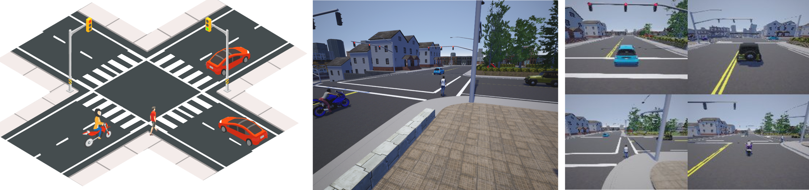
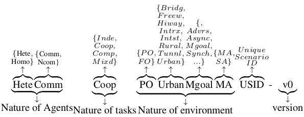

[MACAD-Gym](https://arxiv.org/abs/1911.04175) is a training platform for Multi-Agent Connected Autonomous
 Driving (MACAD) built on top of the CARLA Autonomous Driving simulator.

MACAD-Gym provides OpenAI Gym-compatible learning environments for various
driving scenarios for training Deep RL algorithms in homogeneous/heterogenous,
communicating/non-communicating and other multi-agent settings. New environments and scenarios
 can be easily added using a simple, JSON-like configuration.

[](https://pypi.python.org/pypi/macad-gym/)
[](https://pypi.python.org/pypi/macad-gym/)
[](https://pepy.tech/project/macad-gym)
### Quick Start

Install MACAD-Gym using `pip install macad-gym`.
 If you have CARLA installed, you can get going using the following 3 lines of code. If not, follow the
[Getting started steps](#getting-started).

```python
import gym
import macad_gym
env = gym.make("HomoNcomIndePOIntrxMASS3CTWN3-v0")

# Your agent code here
```

 Any RL library that supports the OpenAI-Gym API can be used to train agents in MACAD-Gym. The [MACAD-Agents](https://github.com/praveen-palanisamy/macad-agents) repository provides sample agents as a starter.

### Usage guide

1. [Getting Started](#getting-started)
1. [Learning platform & agent interface](#learning-platform-and-agent-interface)
1. [Citing MACAD-Gym](#citing)
1. [Developer Contribution Guide](CONTRIBUTING.md)

### Getting Started

> Assumes an Ubuntu (16.04/18.04 or later) system.

1. Install the system requirements:
	- Miniconda/Anaconda 3.x
		- `wget -P ~ https://repo.anaconda.com/miniconda/Miniconda3-latest-Linux-x86_64.sh; bash ~/Miniconda3-latest-Linux-x86_64.sh`
	- cmake (`sudo apt install cmake`)
	- zlib (`sudo apt install zlib1g-dev`)
	- [optional] ffmpeg (`sudo apt install ffmpeg`)
   
1. Setup CARLA (0.9.x)

    3.1 `mkdir ~/software && cd ~/software`

    3.2 Example: Download the 0.9.4 release version from: [Here](https://drive.google.com/file/d/1p5qdXU4hVS2k5BOYSlEm7v7_ez3Et9bP/view)
    Extract it into `~/software/CARLA_0.9.4`
    
    3.3 `echo "export CARLA_SERVER=${HOME}/software/CARLA_0.9.4/CarlaUE4.sh" >> ~/.bashrc`

1. Install MACAD-Gym:
   - **Option1 for users** : `pip install macad-gym`
   - **Option2 for developers**:
     - Fork/Clone the repository to your workspace:
        `git clone https://github.com/praveen-palanisamy/macad-gym.git && cd macad-gym`
     - Create a new conda env named "macad-gym" and install the required packages:
      `conda env create -f conda_env.yml`
     - Activate the `macad-gym` conda python env:
      `source activate macad-gym`
     - Install the `macad-gym` package:
	  `pip install -e .`
     - Install CARLA PythonAPI: `pip install carla==0.9.4`
     > NOTE: Change the carla client PyPI package version number to match with your CARLA server version
     

### Learning Platform and Agent Interface

The MACAD-Gym platform provides learning environments for training agents in both,
single-agent and multi-agent settings for various autonomous driving tasks and 
scenarios that enables training agents in homogeneous/heterogeneous
The learning environments follows naming convention for the ID to be consistent
and to support versioned benchmarking of agent algorithms.
The naming convention is illustrated below with `HeteCommCoopPOUrbanMgoalMAUSID`
as an example:


The number of training environments in MACAD-Gym is expected to grow over time
(PRs are very welcome!). 

#### Environments

The environment interface is simple and follows the widely adopted OpenAI-Gym
interface. You can create an instance of a learning environment using the 
following 3 lines of code:

```python
import gym
import macad_gym
env = gym.make("HomoNcomIndePOIntrxMASS3CTWN3-v0")
```

Like any OpenAI Gym environment, you can obtain the observation space and action
spaces as shown below:

```bash
>>> print(env.observation_space)
Dict(car1:Box(168, 168, 3), car2:Box(168, 168, 3), car3:Box(168, 168, 3))
>>> print(env.action_space)
Dict(car1:Discrete(9), car2:Discrete(9), car3:Discrete(9))
```

To get a list of available environments, you can use
the `list_available_envs()` function as shown in the code snippet below:

```python
import gym
import macad_gym
macad_gym.list_available_envs()
```
This will print the available environments. Sample output is provided below for reference:

```bash
Environment-ID: Short description
{'HeteNcomIndePOIntrxMATLS1B2C1PTWN3-v0': 'Heterogeneous, Non-communicating, '
                                          'Independent,Partially-Observable '
                                          'Intersection Multi-Agent scenario '
                                          'with Traffic-Light Signal, 1-Bike, '
                                          '2-Car,1-Pedestrian in Town3, '
                                          'version 0',
 'HomoNcomIndePOIntrxMASS3CTWN3-v0': 'Homogenous, Non-communicating, '
                                     'Independed, Partially-Observable '
                                     'Intersection Multi-Agent scenario with '
                                     'Stop-Sign, 3 Cars in Town3, version 0'}
```

#### Agent interface
The Agent-Environment interface is compatible with the OpenAI-Gym interface
thus, allowing for easy experimentation with existing RL agent algorithm 
implementations and libraries. You can use any existing Deep RL library that supports the Open AI Gym API to train your agents.

The basic agent-environment interaction loop is as follows:


```python
import gym
import macad_gym


env = gym.make("HomoNcomIndePOIntrxMASS3CTWN3-v0")
configs = env.configs
env_config = configs["env"]
actor_configs = configs["actors"]


class SimpleAgent(object):
    def __init__(self, actor_configs):
        """A simple, deterministic agent for an example
        Args:
            actor_configs: Actor config dict
        """
        self.actor_configs = actor_configs
        self.action_dict = {}


    def get_action(self, obs):
        """ Returns `action_dict` containing actions for each agent in the env
        """
        for actor_id in self.actor_configs.keys():
            # ... Process obs of each agent and generate action ...
            if env_config["discrete_actions"]:
                self.action_dict[actor_id] = 3  # Drive forward
            else:
                self.action_dict[actor_id] = [1, 0]  # Full-throttle
        return self.action_dict


agent = SimpleAgent(actor_configs)  # Plug-in your agent or use MACAD-Agents
for ep in range(2):
    obs = env.reset()
    done = {"__all__": False}
    step = 0
    while not done["__all__"]:
        obs, reward, done, info = env.step(agent.get_action(obs))
        print(f"Step#:{step}  Rew:{reward}  Done:{done}")
        step += 1
env.close()
```

### Citing:

If you find this work useful in your research, please cite:

```bibtex
@misc{palanisamy2019multiagent,
    title={Multi-Agent Connected Autonomous Driving using Deep Reinforcement Learning},
    author={Praveen Palanisamy},
    year={2019},
    eprint={1911.04175},
    archivePrefix={arXiv},
    primaryClass={cs.LG}
}
```

<details><summary>Citation in other Formats: (Click to View)</summary>
<p>
<div id="gs_citt"><table><tbody><tr><th scope="row" class="gs_cith">MLA</th><td><div tabindex="0" class="gs_citr">Palanisamy, Praveen. "Multi-Agent Connected Autonomous Driving using Deep Reinforcement Learning." <i>arXiv preprint arXiv:1911.04175</i> (2019).</div></td></tr><tr><th scope="row" class="gs_cith">APA</th><td><div tabindex="0" class="gs_citr">Palanisamy, P. (2019). Multi-Agent Connected Autonomous Driving using Deep Reinforcement Learning. <i>arXiv preprint arXiv:1911.04175</i>.</div></td></tr><tr><th scope="row" class="gs_cith">Chicago</th><td><div tabindex="0" class="gs_citr">Palanisamy, Praveen. "Multi-Agent Connected Autonomous Driving using Deep Reinforcement Learning." <i>arXiv preprint arXiv:1911.04175</i> (2019).</div></td></tr><tr><th scope="row" class="gs_cith">Harvard</th><td><div tabindex="0" class="gs_citr">Palanisamy, P., 2019. Multi-Agent Connected Autonomous Driving using Deep Reinforcement Learning. <i>arXiv preprint arXiv:1911.04175</i>.</div></td></tr><tr><th scope="row" class="gs_cith">Vancouver</th><td><div tabindex="0" class="gs_citr">Palanisamy P. Multi-Agent Connected Autonomous Driving using Deep Reinforcement Learning. arXiv preprint arXiv:1911.04175. 2019 Nov 11.</div></td></tr></tbody></table></div><div id="gs_citi"><a class="gs_citi" href="https://scholar.googleusercontent.com/scholar.bib?q=info:xm26aHYhVDgJ:scholar.google.com/&amp;output=citation&amp;scisdr=CgXTGHMuEN628ARjSCI:AAGBfm0AAAAAXetmUCK7vBmr1OtOq0KVG6IXDlyHhBdl&amp;scisig=AAGBfm0AAAAAXetmUIGOLisMm--ltk35iSX92VU3dlmg&amp;scisf=4&amp;ct=citation&amp;cd=-1&amp;hl=en">BibTeX</a> <a class="gs_citi" href="https://scholar.googleusercontent.com/scholar.enw?q=info:xm26aHYhVDgJ:scholar.google.com/&amp;output=citation&amp;scisdr=CgXTGHMuEN628ARjSCI:AAGBfm0AAAAAXetmUCK7vBmr1OtOq0KVG6IXDlyHhBdl&amp;scisig=AAGBfm0AAAAAXetmUIGOLisMm--ltk35iSX92VU3dlmg&amp;scisf=3&amp;ct=citation&amp;cd=-1&amp;hl=en">EndNote</a> <a class="gs_citi" href="https://scholar.googleusercontent.com/scholar.ris?q=info:xm26aHYhVDgJ:scholar.google.com/&amp;output=citation&amp;scisdr=CgXTGHMuEN628ARjSCI:AAGBfm0AAAAAXetmUCK7vBmr1OtOq0KVG6IXDlyHhBdl&amp;scisig=AAGBfm0AAAAAXetmUIGOLisMm--ltk35iSX92VU3dlmg&amp;scisf=2&amp;ct=citation&amp;cd=-1&amp;hl=en">RefMan</a> <a class="gs_citi" href="https://scholar.googleusercontent.com/scholar.rfw?q=info:xm26aHYhVDgJ:scholar.google.com/&amp;output=citation&amp;scisdr=CgXTGHMuEN628ARjSCI:AAGBfm0AAAAAXetmUCK7vBmr1OtOq0KVG6IXDlyHhBdl&amp;scisig=AAGBfm0AAAAAXetmUIGOLisMm--ltk35iSX92VU3dlmg&amp;scisf=1&amp;ct=citation&amp;cd=-1&amp;hl=en" target="RefWorksMain">RefWorks</a> </div>
</p>
</details>

###### **NOTEs**:
- MACAD-Gym supports multi-GPU setups and it will choose the GPU that is less loaded to launch the simulation needed for the RL training environment

- MACAD-Gym is for CARLA 0.9.x & above . If you are
looking for an OpenAI Gym-compatible agent learning environment for CARLA 0.8.x (stable release),
use [this carla_gym environment](https://github.com/PacktPublishing/Hands-On-Intelligent-Agents-with-OpenAI-Gym/tree/master/ch8/environment).
